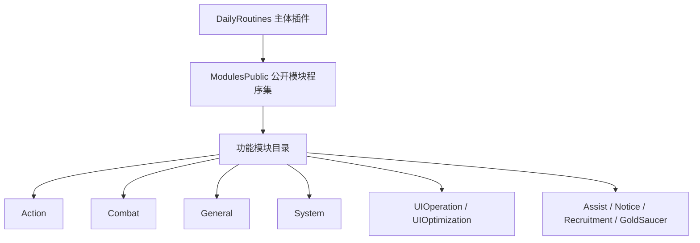

# 架构设计

## 总体架构

## 架构说明
- 本仓库采用“按功能目录划分 + 单文件功能模块”结构
- 每个模块目录包含多个独立功能实现，降低耦合并便于增量维护
- 构建由 `Dalamud.CN.NET.Sdk` 驱动，输出插件模块程序集供主插件加载

## 关键设计约束
- 以插件运行时行为为准，文档必须反映真实代码
- 新增功能优先放入已有领域目录，避免跨目录混杂
- 模块变更后同步更新 `wiki/modules/*.md`

## 重大架构决策（ADR索引）
| adr_id | title | date | status | affected_modules | details |
|---|---|---|---|---|---|
| ADR-INIT-001 | 建立 HelloAGENTS 知识库并按目录模块化维护 | 2026-03-04 | 已采纳 | 全部 | `~init` 初始化 |

